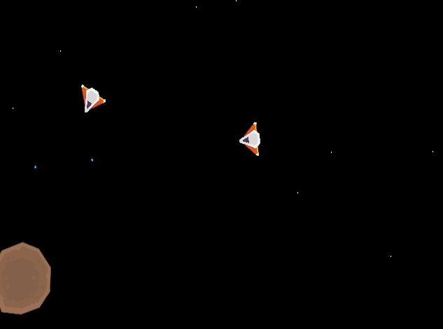

# Marauder

Prototype implementation (with libGDX) of the classic game Marauder (http://shawnhargreaves.com/marauder/).

Controls:

* Cursor keys for movement
* Space for weapons
* F3 for debug mode

Some features from the classic game are not implemented:

* Buying improvements an ammunition on planets
* Improved enemy KI 

## Assets

* Assets by Kenney (https://www.kenney.nl/assets) (CC0)

## Authors

* seeseekey - https://seeseekey.net

## License

The source code is licensed under MIT license.

## Weblinks

You can find the offical repository under:

https://github.com/seeseekey/Marauder